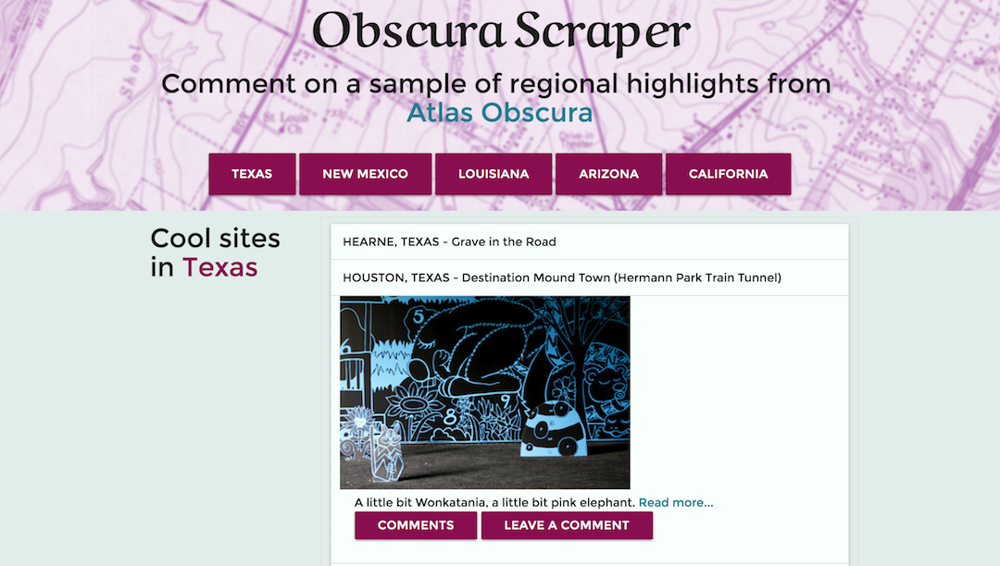

# Obscura Scraper

(Node.js, Express.js, Mongoose.js, MongoDB, Cheerio, Materialize) A web scraper that displays place snippets from Atlas Obscura and allows users to comment on places they've visited/would like to visit.

Figuring out how to scrape took a little time, but it helped me get refamiliarized with jQuery DOM traversal. I went a little crazy and decided to add an option for multiple locations. The scraping was identical for all of the locations, however sorting out how to store and grab the articles for each location required a little regex, which was another nice thing to revisit and re-learn. 

[Heroku link](https://aqueous-caverns-94383.herokuapp.com/)